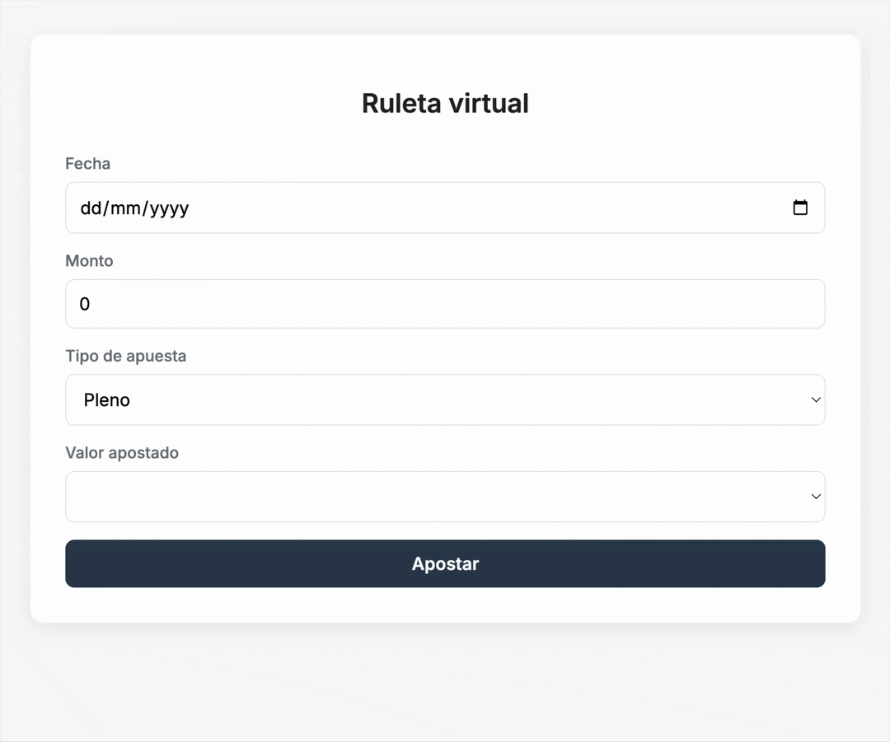
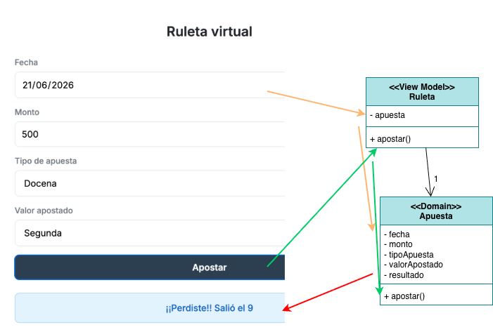

# 🔄 Conversor Pelela

[](https://github.com/uqbar-project/eg-conversor-millas-pelela/actions/workflows/ci.yml)

## 🚀 Cómo ejecutarlo

Como de costumbre

```bash
nvm use
pnpm install
pnpm dev
```

Abrí tu navegador e ingresá a [http://localhost:5173](http://localhost:5173) para ver la aplicación funcionando en vivo.

## 🎲 El ejemplo



Tenemos una ruleta virtual donde podemos apostar

- un determinado monto de dinero
- a que sale un número exacto (pleno) o un número en una docena
- para una fecha determinada

Esto define un formulario con validaciones y un botón para apostar, donde podemos ganar o perder.

## Binding



El formulario tiene un binding complejo:

- los inputs fecha y monto están asociados a **apuesta.**fecha y **apuesta.**monto respectivamente. El view model conoce a la apuesta que es un objeto de dominio con comportamiento rico
- la lista de tipos de apuesta (pleno, docena) la define el view model, pero el binding del select es contra el tipo de apuesta de la apuesta
- y la lista de valores a apostar depende del tipo de apuesta, por eso un cambio en el tipo de apuesta dispara reactivamente un cambio en el segundo select: `valor of apuesta.tipoApuesta.valoresAApostar`

El lector podrá pensar: ¿no hay aquí un smell? Hablamos de la Ley de Demeter, y efectivamente, nos pasa que la vista está altamente acoplada con el elemento con el que interactúa. Ésto es algo bastante frecuente a la hora de diseñar interfaces de usuario, y es normal que haya un acoplamiento alto entre estos componentes.

## Manejo de errores

Al apostar, tenemos que validar que

- la fecha exista y sea mayor o igual a la fecha de hoy
- el monto sea positivo, pero también debe ser mayor al mínimo para la apuesta por pleno/docena
- debe ingresarse un tipo de apuesta y un valor apostado

Como las excepciones cortan el flujo de envío de mensajes, no vamos a utilizar esta técnica, sino que vamos a recolectar una lista de errores y los vamos a asociar a campos/atributos de nuestro objeto de dominio. Como además trabajamos con binding, no vamos a devolver esa lista sino que lo guardamos dentro del objeto apuesta. Esta decisión está afectada sin dudas por la tecnología de la vista, el dominio no es inocente de esta situación pero es un costo razonable para pagar y además ésto no nos impide hacer un testeo unitario como lo veníamos haciendo anteriormente en materias anteriores.

Por otra parte, utilizamos un componente especial para mostrar los errores:

- el Validador parametriza el atributo: "fecha", "monto", "tipoApuesta", etc.
- y muestra el mensaje de error asociado a cada atributo **inmediatamente después** de presentar el control para que el usuario cargue esa información

Eso permite que de un golpe de vista rápido podamos asociar los campos que están bien vs. los que hay que corregir para poder hacer la apuesta correctamente.

El lector puede ver la implementación del [componente pelela](./src/validador.pelela) como de [su view model](./src/validador.ts)

## Strategy tipo de apuesta

Apuesta tiene un strategy para manejar los tipos de apuesta pleno y docena. Eso permite delegar

- validaciones extra como el monto mínimo necesario para apostar
- el monto que se gana
- o si una apuesta resulta ganadora

Por otra parte, el select del tipo de apuesta necesita usar los singletons PLENO y DOCENA y no construir nuevos objetos. De lo contrario cuando el usuario seleccione "Docena" si generamos otro objeto Docena lo que nos pasaría es que

```ts
new Docena() == new Docena()
```

nos devolvería `false` y en ese caso no veríamos seleccionado ningún valor en el combo/select.

## Apostar

El view model tiene su propio método apostar. Ésto ocurre porque

- por un lado delega en el objeto de dominio `Apuesta` las cuestiones de negocio, como determinar si ganó o perdió, información que queda...
- ...en el atributo `resultado` que está bindeado a un div
- pero además queremos mostrar una animación en el caso de haber ganado, y es algo que el objeto Apuesta no debe manejar. Para eso tenemos un componente **confetti** que salta cuando la apuesta nos avisa que ganó.

```ts
apostar(): void {
  this.apuesta.apostar()
  if (this.apuesta.resultado?.gano()) {
    // manejo de vista
    confetti({
      particleCount: 150,
      spread: 80,
      origin: { y: 0.6 },
    })
  }
}
```

## Testeo unitario

Si bien Pelela no trae testeo de front (por una decisión didáctica), este ejemplo muestra cómo podemos cubrir tests de dominio tanto para la [apuesta](./src/domain/apuesta.test.ts) como para el [resultado](./src/domain/resultado.test.ts). En particular pueden mirar cómo se controla el número que sale para ver el mensaje que recibe el usuario:

```ts
it('apuesta pleno gana cuando acierta el número', () => {
  vi.spyOn(Apuesta.prototype, 'obtenerNumeroGanador').mockImplementation(() => 5)
  const apuesta = new Apuesta()
  apuesta.fecha = new Date()
  apuesta.monto = 100
  apuesta.tipoApuesta = PLENO
  apuesta.valorApostado = 5
  apuesta.apostar()
  expect(apuesta.resultado?.gano()).toBe(true)
})
```

Para evitar que la definición de un stub pueda afectar otros tests tenemos el método afterEach que vuelve a la apuesta a su definición original (al azar):

```ts
afterEach(() => {
  vi.restoreAllMocks()
})
```
