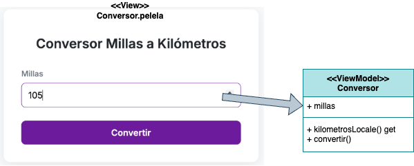
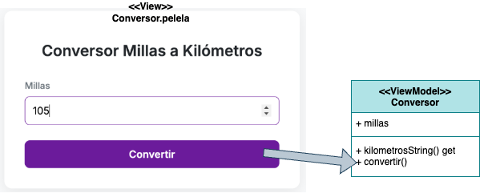
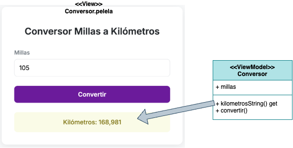
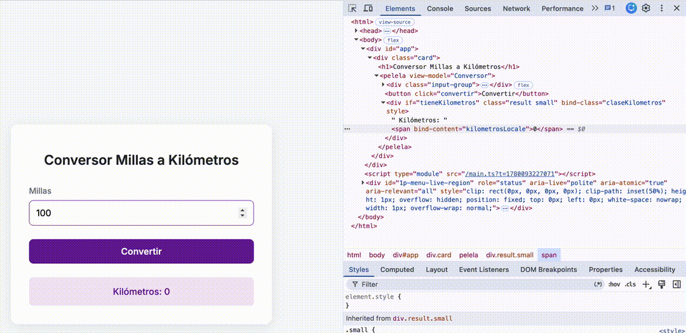

# 🔄 Conversor Pelela

[](https://github.com/uqbar-project/eg-conversor-millas-pelela/actions/workflows/ci.yml)

## 🚀 Cómo ejecutarlo

> **Nota sobre Node.js:** Este proyecto requiere la versión LTS de Node.js especificada en el archivo `.nvmrc` y en el `package.json` (`engines.node`, ej. Node 24). Si tu versión actual es más antigua, te recomendamos ejecutar `nvm use` (o instalar la versión requerida) antes de continuar.

1. **Instalar las dependencias:**

Este proyecto utiliza `pnpm` como gestor de paquetes. Para instalar todo lo necesario, ejecutá:

```bash
pnpm install
```

1. **Levantar el servidor de desarrollo:**

Una vez instaladas las dependencias, arrancá el entorno con:

```bash
pnpm dev
```

1. **Ver la aplicación:**

Abrí tu navegador e ingresá a [http://localhost:5173](http://localhost:5173) para ver la aplicación funcionando en vivo.

## 🔎 El primer ejemplo del binding

Tenemos dentro de la carpeta `src` una tríada

- `conversor.pelela`: Es la vista (HTML) donde definimos nuestros componentes visuales y los asociamos mediante el binding con código dinámico
- `conversor.ts`: Contiene la lógica, el estado y el comportamiento (View-Model).
- `conversor.css`: Los estilos dedicados para este componente.

💡 **Tip:** Podés renombrar estos tres archivos en cualquier momento (usando el CLI: `pelela rename Conversor MiConversor`) y el framework automáticamente tomará los cambios gracias a su registro dinámico.

## Reglas para los archivos

- Las clases de Typescript siguen el formato camelCase (sin espacios, cada palabra comienza con la primera letra en mayúscula)
- Los archivos .pelela, .ts y .css siguen el formato snake-case (sin espacios, se separa cada palabra con un guión medio)

---

## 🛠️ Extensiones Recomendadas

Si utilizás VSCode o similares (Cursor, VSCodium, Windsurf, Antigravity), te recomendamos instalar las siguientes extensiones para aprovechar al máximo el entorno:

- **PelelaJS** (`uqbar.pelela-vscode`): Autocompletado, resaltado de sintaxis y diagnóstico para archivos `.pelela`.
- **Biome** (`biomejs.biome`): Linter y formateador ultrarrápido configurado por defecto en este proyecto.

---

## El ejemplo

- Cuando el usuario escribe el valor en millas, el binding funciona desde la vista hacia el modelo (`bind-value="millas"`), es decir que eso va asignando el valor que se escribe dentro de la variable `millas` de la clase `Conversor`. 
- Al presionar el botón Convertir, el binding es nuevamente desde la vista hacia el modelo, a través del método `convertir`, que no tiene parámetros. En el binding **no podés usar expresiones, solo llamar a atributos o propiedades (funciones get)**
- El método convertir produce un cambio en el modelo: la variable `kilometros` se asigna en base al cálculo de conversión
- Pero eso no es todo, hay tres propiedades que dependen de `kilometros`: `tieneKilometros`, `claseKilometros` y `kilometrosLocale`...
- ...entonces Pelela las recalcula y el binding va ahora **desde el modelo hacia la vista**, actualizando los elementos del DOM...
- ...y eso produce que se visualice el div que muestra un label con la conversión en kilómetros con coma decimal y formateado según la clase css correspondiente

### Binding vista a modelo



El usuario escribe el valor en millas, en el modelo se asigna sucesivamente:

- atributo millas, valor: 1
- atributo millas, valor: 10
- atributo millas, valor: 105

### Evento disparado desde la vista



El usuario presiona el botón "Convertir", eso se asocia al método convertir() en nuestro view model Conversor. Eso produce cambios dentro de nuestro modelo: el atributo `kilometros` pasa a tener el valor 168.981

### Binding modelo a vista



Entonces cada una de las "propiedades" de la vista interesadas en kilometros se vuelve a renderizar:

- los kilómetros localizados
- la clase que define cómo se muestran los kilómetros
- y el booleano que indica si tenemos kilómetros

> Pelela usa las definiciones de los métodos para entender cuáles son las dependencias: cualquier cambio en kilómetros dispara cambios en `kilometrosLocale`, `claseKilometros` y `tieneKilometros`. Y cualquiera de esos cambios es escuchado por los elementos del DOM de la vista para volverse a mostrar.



### Renderizado condicional

La propiedad `tieneKilometros` nos sirve para el renderizado condicional:

- si es true aparecen los kilómetros
- si es falso **no se muestra**

## Reglas de pelela

- La vista se define en el archivo .pelela, el modelo (viewModel) en el archivo .ts, si hay estilos van en el archivo .css
- El binding es siempre 1 propiedad de la vista con 1 propiedad de tu modelo. Podríamos extenderlo, pero queremos mantener un mapeo simple
- No se puede usar expresiones en un archivo .pelela, hay que escribirlas en tu modelo. Ejemplo: no podés escribir

```html
<div if="kilometros > 0">     ❌ no queremos eso
<div if="tieneKilometros">    ✅ sí ésto
```

- Para definir propiedades usamos el syntactic sugar `get` de Typescript que permite ver un método como una propiedad de una clase. Ejemplo: `get kilometrosLocale() { ... }`
